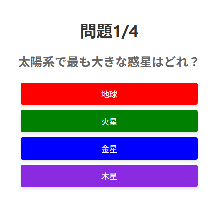
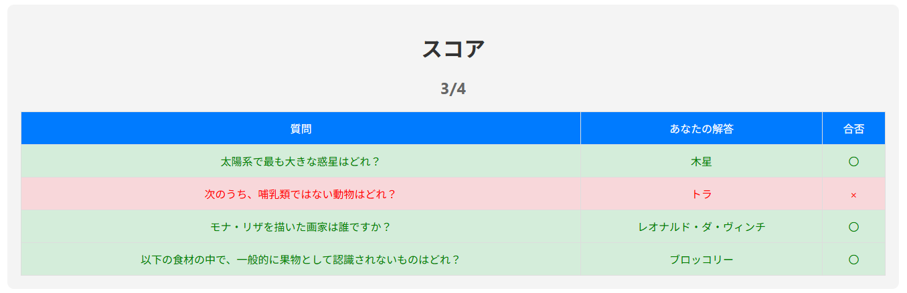

# ❓ QUIZ-APP（React製クイズアプリ）

## 🔍 概要
このアプリは、Reactを用いて作成されたシンプルなクイズアプリです。  
画面に表示される選択式の質問に答え、全4問のスコアを確認することができます。  
リアルタイムでの解答処理、スコア計算、正誤判定を通じて、Reactの基礎的なステート管理やイベント処理を学ぶことを目的としています。

---

## 🛠 使用技術
- React（CRA）
- JavaScript (ES6+)
- HTML / CSS
- Git / GitHub

---

## ✨ 主な機能
- クイズ形式の選択問題を出題
- 選択肢をクリックすると即座に正誤を判定
- 正解数に応じたスコアを表示
- スコアボードで解答履歴の確認が可能
- 正解は緑、間違いは赤でハイライト表示

---

## 📷 スクリーンショット
### ✅ クイズ画面


### ✅ 結果画面


---

## 📂 ディレクトリ構成（抜粋）
```
QUIZ-APP/ 
├── public/ 
│ ├── index.html 
│ └── logo192.png 
├── src/
│ ├── App.jsx 
│ ├── index.js 
│ ├── App.css 
│ └── index.css 
├── package.json 
└── README.md
```

---

## 💻 起動方法（開発用）
```bash
git clone https://github.com/Jozet42/quiz-app.git
cd quiz-app
npm install
npm start
```

---

## 🧪 今後の拡張案
- 問題数の増加・ランダム化
- 終了後のリトライ機能
- 問題データの外部JSON化
- 難易度設定の追加
- 成績をローカルストレージに保存

---

## 🙌 制作メモ
このアプリは、Reactを用いた基本的なステート管理（useState）やイベント処理の理解を目的に作成されました。
職業訓練校における学習課題やポートフォリオ作品として位置付けています。

---

## 📝 更新履歴
2025/04/16：README.md作成、スクリーンショット追加
2025/04/16：README.md構成整備